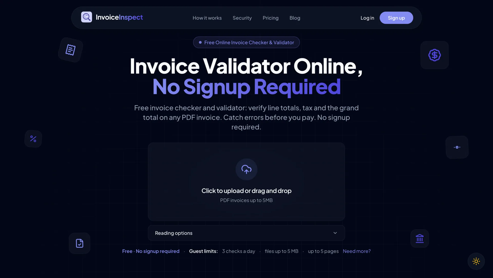

<div align="center">

# InvoiceInspect

**Before you pay an invoice, get a second opinion.**

Upload a PDF invoice and find out in seconds whether the line totals, tax and grand total actually add up, with the evidence to prove it.

[**Try it live → invoiceinspect.app**](https://invoiceinspect.app) · [Portfolio case study](https://aliyanfaisal.com/products/invoiceinspect) · [Request source access](mailto:aliyanbarcha15@gmail.com?subject=InvoiceInspect%20private%20repo%20access)


<br>

<a href="https://invoiceinspect.app">
  
</a>

</div>

---

> **This is a showcase repository.** The full source code lives in a private repository. The product is live and free to use with no signup, and I'm happy to give access to the source on request: [email me](mailto:aliyanbarcha15@gmail.com?subject=InvoiceInspect%20private%20repo%20access).

## What it does

InvoiceInspect is an invoice validator for finance teams, accounts payable, freelancers and business owners. It reads a vendor invoice, rebuilds every number from scratch and flags anything that doesn't reconcile **before** money leaves the account.

- **Line items:** quantity × unit price checked against every line total.
- **Subtotal and grand total:** line sums, discounts, shipping and tax reconciled against the printed totals.
- **VAT / GST / sales tax:** rates compared with the tax amounts actually charged, and tax IDs checked for presence.
- **Duplicate charges:** repeated line items and double-billed amounts surfaced for review.
- **Missing fields:** invoice number, dates and other required details called out.
- **Evidence, not just a verdict:** each finding shows *Expected* vs *Invoice says* vs *Difference*, tied back to the page it came from.

## Why it's trustworthy

The core idea is simple: **money math should never be guessed by a language model.**

| Layer | Job | Approach |
| --- | --- | --- |
| **Extraction** | Turn a PDF into structured fields | Native text extraction, with OCR for scanned documents |
| **Verification** | Decide if the numbers are right | **Deterministic rules engine**: plain arithmetic, no AI in the verdict |
| **Reasoning** | Explain findings in plain English | LLM layer that explains and double-checks, but never overrides the math |
| **Review** | Handle unreadable numbers | When a value can't be read with confidence, the user picks the correct one and the checks re-run |

## Highlights

- **Rules-based verification engine** with independent rules for line totals, subtotals, grand total, tax, expected rates, required fields and duplicate charges.
- **Dual-path PDF reading:** text-based and OCR-based extraction, with a visible *scan reading quality* indicator.
- **Cross-checking:** a second look from an LLM compares its read against the rules extractor to catch misreads.
- **Downloadable PDF report** of the results for sharing with a vendor or an approver.
- **Evaluation harness:** a built-in dataset generator and scorer measures extraction and finding accuracy, so changes are tested against numbers rather than vibes.
- **Provider-agnostic AI layer** with fallback between providers.
- **Plans and limits:** guest, free and paid tiers with per-day and per-minute limits, file-size and page caps.
- **Accounts and admin:** signup, login, email verification, password reset, and an admin dashboard for users, usage analytics, plans, SMTP settings and email logs.
- **Content and SEO:** blog system with Markdown rendering, guides, tax-specific landing pages (VAT, GST), sitemap and structured data.

## Privacy by design

Free-tier uploads are **processed in memory and never stored**. There is no file persistence in the free flow. See the [Security page](https://invoiceinspect.app/security) for details.

## Tech stack

| Area | Tools |
| --- | --- |
| Backend | Laravel 13, PHP 8.3+ |
| Frontend | Blade, Tailwind CSS 4, Vite |
| Database | PostgreSQL |
| PDF and OCR | PDF text inspection, page rendering, Tesseract OCR |
| AI | Claude and OpenRouter providers behind a common interface with fallback |
| Testing | PHPUnit / Laravel test suite, plus a custom evaluation harness |
| Deployment | GitHub Actions |

## Architecture at a glance

```text
PDF upload
   │
   ▼
PdfInspector ──► text layer ─┐
   │                         ├─► NormalizedDocument
   └──► OCR (if scanned) ────┘
                                   │
                                   ▼
                       RulesExtractor  (+ vision cross-check)
                                   │
                                   ▼
                    Verifier ── deterministic rules
                    (line · subtotal · total · tax · rates · duplicates · required fields)
                                   │
                                   ▼
              Findings ──► AI explanation ──► Results page / PDF report
```

## Links

- **Live app:** [invoiceinspect.app](https://invoiceinspect.app)
- **Case study and details:** [aliyanfaisal.com/products/invoiceinspect](https://aliyanfaisal.com/products/invoiceinspect)
- **Source access:** [aliyanbarcha15@gmail.com](mailto:aliyanbarcha15@gmail.com?subject=InvoiceInspect%20private%20repo%20access)

## About the author

Built by **Aliyan Faisal**, a full-stack developer who builds products end to end, from the rules engine to the deployment pipeline. More of my work is on my [portfolio](https://aliyanfaisal.com).

Interested in the code, a similar build, or working together? Reach out at [aliyanbarcha15@gmail.com](mailto:aliyanbarcha15@gmail.com).

---

<sub>© Aliyan Faisal. All rights reserved. This repository contains documentation and screenshots only.</sub>
